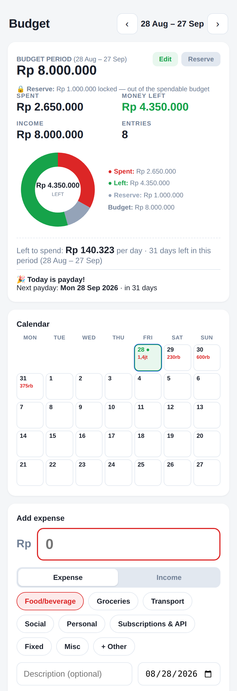

# Build Diary - Gabriel Asael Tarigan

Automated engineering log. What I build, run, and ship - updated daily.

- Systems: self-hosted AI competition platform (ARISE), student surveys, quiz portals, budget app, research paper pipeline
- See `entries/` for the daily log.
- Latest highlights:

*The Budget App - payday-cycle budgeting, locked reserve, per-category caps, traffic-light bars, period calendar, Excel export.*
